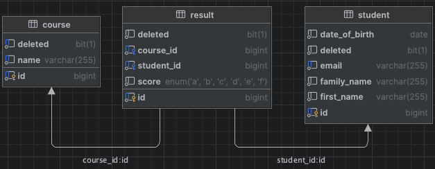

# Student Result Management System

A Spring Boot-based GraphQL API for managing student results.

## Tech Stack
- **Backend Framework**: Spring Boot
- **API**: GraphQL
- **Database**: MySQL
- **Build Tool**: Maven
- **JDK Version**: 17
- **Containerization**: Docker


## Assumptions
The below assumptions are made while developing the application:
- The documentation does not mention any authentication or authorization mechanisms, so it is assumed that these are pre-configured and not part of the current scope.
- The requirements include only create, delete, and list operations for Student, Course, and Results entities. Update operations are not required as they are not mentioned in the provided documentation.

## ER Diagram


## GraphQL Endpoints
1. **Query Operations**:
   - `students`: Fetch student information
   - `courses`: Retrieve course details
   - `results`: Retrieve results

2. **Mutation Operations**:
   - `addStudent`: Add new student
   - `addCourse`: Create new course
   - `addResult`: Add new result
   - `deleteStudent`: Remove student
   - `deleteCourse`: Remove course
   - `deleteResult`: Remove result

## Postman Collection
GraphQL Collection for Queries and mutations: [Click Here](https://dark-zodiac-426384.postman.co/workspace/My-Workspace~e0a41bee-9ca5-45ef-8078-ad9fd6eb1b98/collection/6865678b0f5572fa9985e8f3?action=share&creator=28583311)

## Application Startup Guide
1. Clone the repository
```
git clone
```
2. Start application using
```
docker-componse up --build
```
The App would be up and running on default 8080 port, the port can be changed from application.properties file, moreover, container for mysql instance is also configured in docker-compose.yaml if needed port can be changed, but make sure to update environment variable.
